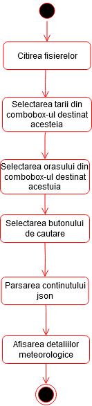

# Aplicatie pentru vreme

## Cuprins
1. [Introducere](#introducere)
2. [Mod de utilizare](#mod-de-utilizare)
    * [Exemplu fisier de intrare](#exemplu-fisier-de-intrare)
3. [Diagrame UML](#diagrame-uml)
    * [Diagrama de clase](#diagrama-de-clase)
    * [Diagrama de activitati](#diagrama-de-activitati)
4. [Realizator](#autor)

## Introducere
Acest repositoy contine o aplicatie JavaFX care ofera utilizatorului, pe baza optiunilor introduse, informatii cu privire la starea meteorologica actuala.

## Mod de utilizare
Aplicatia se bazeaza pe un fisier de input care contine datele de localizare ale oraselor.
Aceste date trebuie sa se regaseasca in fisierul **_src/main/resources/input.txt_** in urmatoarea ordine unde simbolul '#' reprezinta caracterul delimitator:
ID#NumeleOrasului#Latitudine#Longitudine#CodulTarii.

### Exemplu fisier de intrare
819827#Razvilka	55.591667#37.740833#RU 
524901#Moscow#55.752220#37.615555#RU 
2973393#Tarascon#43.805828#4.660280#FR 
2986678#Ploufragan#48.491409#-2.794580#FR 

## Diagrame UML

###Diagrama de activitati

###Diagrama de clase

## Realizator
Nume:	Mihail-Vicentiu DUMITRU 
Grupa:	C124