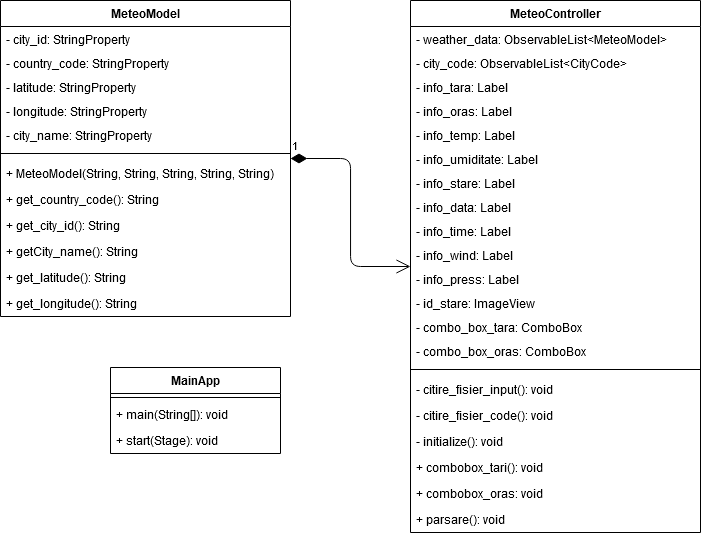

# Aplicatie pentru vreme


## Cuprins
1. [Introducere](#introducere)
2. [Mod de utilizare](#mod-de-utilizare)
    * [Exemplu fisier de intrare](#exemplu-fisier-de-intrare)
3. [Diagrame UML](#diagrame-uml)
    * [Diagrama de clase](#diagrama-de-clase)
    * [Diagrama de activitati](#diagrama-de-activitati)
4. [Realizator](#autor)

## Introducere
Acest repositoy contine o aplicatie JavaFX care ofera utilizatorului, pe baza optiunilor introduse, informatii cu privire la starea meteorologica actuala.

## Mod de utilizare
Aplicatia se bazeaza pe un fisier de input care contine datele de localizare ale oraselor.
Aceste date trebuie sa se regaseasca in fisierul **_src/main/resources/input.txt_** in urmatoarea ordine unde simbolul '#' reprezinta caracterul delimitator:
ID#NumeleOrasului#Latitudine#Longitudine#CodulTarii.

### Exemplu fisier de intrare
```
819827#Razvilka#55.591667#37.740833#RU
524901#Moscow#55.752220#37.615555#RU
2973393#Tarascon#43.805828#4.660280#FR
2986678#Ploufragan#48.491409#-2.794580#FR
683506#Bucharest#44.4323#26.1063#RO
681291#Cluj#46.6494#23.8184#RO
3173435#Milano#45.4643#9.1895#IT
3128760#Barcelona#41.3888#2.159#ES
3117735#Madrid#40.4165#-3.7026#ES
756135#Warsaw#52.2298#21.0118#PL
3094802#Krakow#50.0833#19.9167#PL
3165523#Torino#45.1333#7.3667#IT
2867714#Munich#48.1374#11.5755#DE
2950159#Berlin#52.5244#13.4105#DE
5815135#Washington#47.5001#-120.5015#US
4930956#Boston#42.3584#-71.0598#US
2643743#London#51.5085#-0.1257#GB
2644210#Liverpool#53.4106#-2.9779#GB
2657896#Zurich#47.3667#8.55#CH
4893591#Geneva#41.8875#88.3054#CH
```

## Diagrame UML

### Diagrama de activitati


### Diagrama de clase


## Realizator
Nume:	Mihail-Vicentiu DUMITRU<br/>
Grupa:	C124